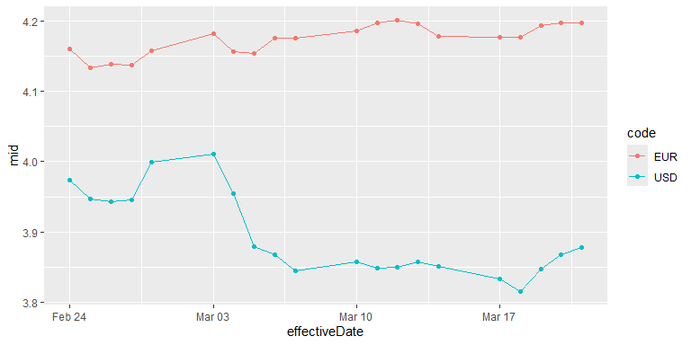
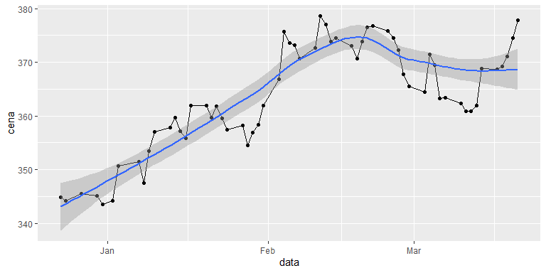

# rnbp

[](https://travis-ci.com/szymanskir/rnbp?branch=master)
[](https://ci.appveyor.com/project/szymanskir/rnbp)
[](https://codecov.io/gh/szymanskir/rnbp?branch=master)

The rnbp package is an R wrapper for the National Bank of Poland API:
<http://api.nbp.pl/>

## Installation

You can install the the development version of rnbp from
[GitHub](https://github.com/) with:

``` r
# install.packages("devtools")
devtools::install_github("szymanskir/rnbp")
```

## Retrieve the currently effective exchange rate table

``` r
library(rnbp)
library(ggplot2)

## Retrieve current C exchange rate table
response <- get_current_exchangerate_table("C")

## Retrieve content from the response
current_exchangerate_table <- response$content$rates[[1]]

ggplot(current_exchangerate_table, aes(x = code, y = bid, fill = code)) + 
  geom_bar(stat = "identity")
```


## Retrieve exchange rates for specific currencies

``` r
## Retrieve last 20 exchange rates for euros
euros_response <- get_last_n_exchangerates("A", "EUR", 20)

## Retrieve last 20 exchange rates for euros
dollars_response <- get_last_n_exchangerates("A", "USD", 20)

## Retrieve rates data
euros_data <- euros_response$content$rates
dollars_data <- dollars_response$content$rates

## Add currency code columns
euros_data$code <- euros_response$content$code
dollars_data$code <- dollars_response$content$code
currency_data <- rbind(euros_data, dollars_data)

ggplot(currency_data, aes(x = effectiveDate, y = mid, col = code)) +
  geom_line() + 
  geom_point()
```



## Retrieve gold prices

``` r
current_date <- Sys.Date()
response <- get_goldprice_from_interval(current_date - 90, current_date)

ggplot(response$content, aes(x = data, y = cena)) + 
  geom_point() +
  geom_line() +
  geom_smooth(method = "loess", formula = y ~ x)
```


